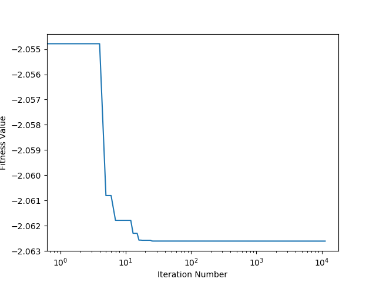

# Particle Swarm Optimization

This repo was made as part of an assignment for the Nature Inspired Computing course at IIT Gandhinagar.

## Problem Statement
Estimate the minimum value of a [Cross-in-tray function](https://en.wikipedia.org/wiki/Test_functions_for_optimization) for -10<=x,y<=10 using PSO.

## How to setup and run
```bash
# Installs all dependencies
pip install -r requirements.txt

# Runs the PSO for cross-in-tray function
python test.py
```

## The PSO Class
The PSO class is defined in pso/pso.py. All input parameters to a PSO class instance are described in the comments in the code file.

## Video of best particle over the iterations (new_video.gif)
The red point indicates the best particle's position.


## Plot of gbest fitness value vs the iterations (new_plot.png)


